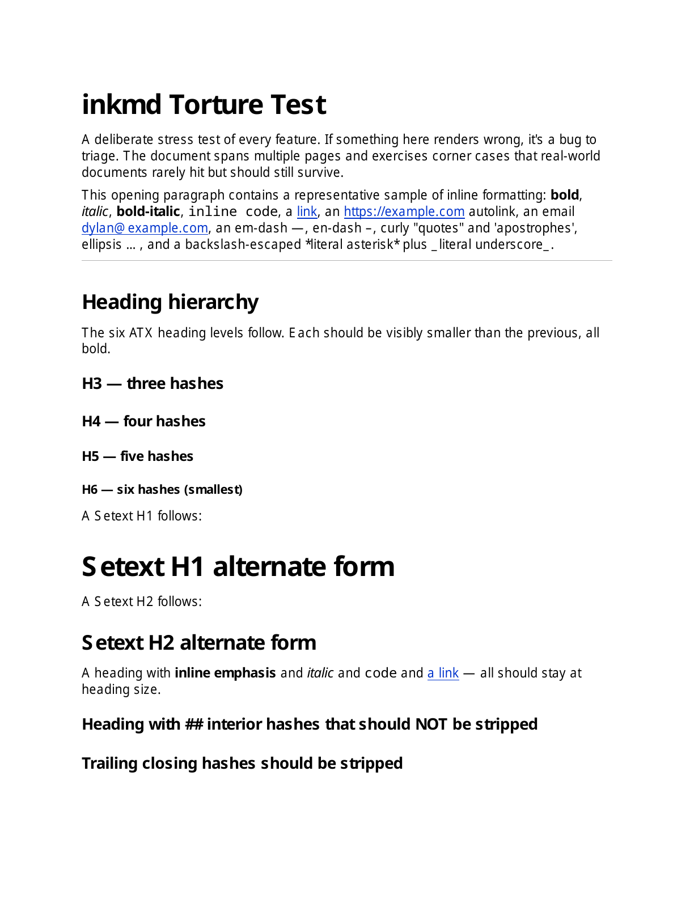

# inkmd

**Pure-Python markdown → PDF compiler. Zero system dependencies. MIT-licensed. Deterministic by default.**

`inkmd` compiles markdown straight to PDF — no browser wrapper, no LaTeX, no HTML/CSS engine. Markdown in, PDF bytes out. If Python runs, `inkmd` runs.

<p align="center">
  
  <br>
  <em>Page 1 of <a href="examples/torture-test.md">examples/torture-test.md</a> rendered through inkmd.</em>
</p>

## Quickstart

```sh
pip install inkmd
inkmd in.md -o out.pdf
```

Or via the library:

```python
import inkmd

inkmd.render_file("in.md", "out.pdf")
# or
pdf_bytes = inkmd.compile(md_text)
```

That's it. No system packages, no fonts to install, no Chrome binary, no `apt-get`. Works the same on macOS, Linux, Windows, Alpine, AWS Lambda, a locked-down CI runner, or a Steam Deck.

## Why does this need to exist?

Every other markdown → PDF tool needs heavy system dependencies:

| Tool | Problem |
|------|---------|
| **wkhtmltopdf** | Deprecated since 2023. Unpatched CVEs. |
| **Chrome headless / Puppeteer** | 200MB+ install. 5-15s cold-start latency. |
| **WeasyPrint** | Needs Pango, cairo, GObject (350-550MB). Breaks on Alpine and Windows. |
| **Pandoc + LaTeX** | 3GB texlive install. |
| **PyMuPDF-based tools** | Don't build on Alpine musl. |
| **`borb`** | AGPL — unusable in closed-source or commercial projects without a paid licence. |

`inkmd` was built for the places where those fail: stripped-down Docker images, serverless functions, locked-down CI runners, embedded hardware. It uses only PDF's 14 base fonts and the Python standard library, so the wheel is tiny and there's nothing to install at the system level.

## Status

**v0.1 — feature-complete, MIT.** 495 tests across 23 files. Stdlib-only Python 3.9+. Byte-deterministic output verified across platforms.

## Install

```sh
pip install inkmd
```

Or, for the single-file zipapp deployment (no `pip` required):

```sh
curl -O https://github.com/eagredev/inkmd/releases/latest/download/inkmd.pyz
python inkmd.pyz in.md -o out.pdf
```

## Usage

### CLI

```sh
inkmd in.md -o out.pdf              # file in, file out
inkmd in.md > out.pdf               # file in, stdout out
inkmd < in.md > out.pdf             # stdin in, stdout out
inkmd in.md -o out.pdf --page-size A4 --family times
inkmd in.md -o out.pdf --no-autolinks
inkmd --version
```

### Library

```python
import inkmd

# Compile markdown text to PDF bytes
pdf_bytes = inkmd.compile(md_text)

# Or convert files directly
inkmd.render_file("input.md", "output.pdf")

# Options
pdf_bytes = inkmd.compile(
    md_text,
    page_size="A4",          # or "letter" (default)
    family="times",          # or "helvetica" (default)
    autolinks=False,         # opt out of GFM bare-URL/email detection
)
```

The public API is intentionally narrow: two functions, no classes to instantiate, no state to manage.

## What `inkmd` supports

### CommonMark (full baseline)

- Paragraphs with wrapping
- ATX (1-6) and Setext headings
- Ordered and unordered lists, with arbitrary nesting and tight/loose detection
- Blockquotes, including multi-paragraph and nested blockquotes that can wrap any block type
- Fenced code blocks (with preserved whitespace and soft-wrap on long lines)
- Code spans
- Emphasis: full left/right-flanking algorithm, rule of 3, intraword-underscore rule, backslash escapes, triple-`***` → nested italic-bold
- Thematic breaks (`---`, `***`, `___`)
- Inline links `[text](url)` and angle-bracket autolinks `<url>`

### GFM extensions

- Pipe tables with alignments (left, center, right) and content-aware column widths
- Fenced code with language tag (info-string preserved on the AST node)
- Bare URL and email autolinks (`https://...`, `www....`, `user@host`, `host.tld/path`)
- Strikethrough (`~~text~~`)

### Visual style

- Clickable PDF `/Link` annotations on every URL — both inline and autolinks
- Blue underlined link text
- Light-grey background fill behind fenced code blocks
- Thin grey vertical rules for blockquotes, stacked side-by-side for nested quotes
- Tinted table headers with full grid borders
- AFM-correct kerning emitted via TJ arrays (Helvetica and Times both kerned)
- Strikethrough drawn as a thin horizontal bar at glyph mid-height

### Typography

- Helvetica family (default) or Times family
- Code uses Courier (regardless of body family)
- WinAnsi character encoding — em-dash, en-dash, curly quotes, ellipsis, most Western European glyphs
- Standard PDF letter and A4 page sizes

### Determinism

`inkmd` produces **byte-identical** PDF output for the same markdown input on every platform, every Python version, every run. No real-time clocks, no random IDs, no platform-dependent iteration order. Useful for version-controlled documents, signed/hashed PDFs, reproducible CI builds, audit trails.

## What `inkmd` doesn't support yet

| Feature | When | Why deferred |
|---------|------|--------------|
| **Images** | v0.2 | Needs image-decoding logic; out of scope for the minimum lovable v0.1 |
| **TTF / OTF font embedding** | v0.2 | v0.1 uses PDF's 14 base fonts — small and dependency-free but limits codepoints to WinAnsi (no CJK, Cyrillic, emoji, most non-Latin scripts; they render as `?`) |
| **Task lists** (`- [ ]` / `- [x]`) | v0.2 | GFM extension; needs list-marker prefix scan |
| **Tables that split across pages** | v0.2 | Tables currently place atomically — a table taller than one page will overflow |
| **Tables inside blockquotes** | v0.2 | Table detection runs at document level only; tables nested in a blockquote are silently dropped |
| **Headers, footers, page numbers** | v0.2 | Needs a per-page chrome system |
| **Tagged PDF / PDF/UA accessibility** | v0.3+ | Under consideration |
| **PDF/A archival format** | — | Not planned |
| **Math (LaTeX-style)** | — | Out of scope. Use Pandoc + LaTeX. |
| **HTML passthrough** | — | Out of scope by design. `inkmd` is markdown → PDF directly. |
| **Themes / CSS** | — | Out of scope. Markdown's value is honest constraints — don't bring CSS back in. |

## How it works

Four layers, each one strictly above the previous:

1. **`parser`** — single-pass container-aware block parser plus a CommonMark inline tokeniser. Produces a frozen-dataclass AST.
2. **`render`** — lowers AST blocks to `RenderedBlock` records with runs, spacing, indent, decorations. Carries font and link state through inline nesting.
3. **`layout`** — wraps runs into pages, positions each `PositionedRun` against the page coordinate system, emits background rectangles for code blocks, vertical rules for blockquotes, underline + annotation pairs for links, and bars for strikethrough.
4. **`pdf`** — serialises pages into PDF bytes. Text via `Tj`/`TJ`-with-kerning, graphics via `rg`/`re`/`f`, link annotations via per-page `/Annots` arrays.

No layer imports a higher one. The whole pipeline is ~3,500 lines of pure-Python logic plus ~4,700 lines of generated AFM kerning tables.

A deeper write-up is in progress — for now, the source is fairly self-documenting and `LIZARD-AUDIT.md` covers the complexity profile.

## A note on font rendering in v0.1

`inkmd` v0.1 uses PDF's **14 base fonts** (Helvetica, Times, Courier, Symbol, ZapfDingbats and their variants). These are spec-mandated to be available in every conforming PDF reader, so we don't ship any font files — the output stays tiny and dependency-free.

The trade-off is that the *actual rendering* depends on which Helvetica (or Times, etc.) the reader's system provides:

- **macOS** ships Helvetica Neue (real Helvetica). Renders as designed.
- **Windows** with Adobe Reader ships real Helvetica. Renders as designed.
- **Linux** typically substitutes Nimbus Sans (URW++'s free Helvetica clone). Renders very similarly but with slightly different side bearings — spacing between glyphs can look subtly different.
- **Mobile** (iOS/Android) ships system Helvetica/Roboto variants. Mostly fine.

The advance widths are correct everywhere (PDF readers honour the AFM-published metrics), so layout — page breaks, line wrapping, paragraph flow — is identical across systems. What varies is the precise glyph shape *within* each advance-width box, which can produce slightly different visual spacing.

For most use cases this is fine. If you need pixel-identical rendering across every system (e.g. for signed/archival documents), wait for **v0.2 font embedding**, which will bundle font outlines inside each PDF.

## Roadmap

- **v0.1** — Core: markdown → PDF for the subset above, library + CLI, MIT, deterministic. **Shipped.**
- **v0.2** — Font embedding (full Unicode), images, task lists, headers/footers/page numbers, page-splitting for oversized tables, tables-in-blockquotes.
- **v0.3** — Tagged PDF / accessibility, TOC generation, cross-references.
- **post-v1.0** — Optimisations, additional page sizes, PDF/A consideration.

## Licence

MIT. See [LICENSE](LICENSE).

## Acknowledgements

The 14 standard PDF fonts and their AFM metric files are public-domain artefacts published by Adobe ([adobe-type-tools/Core14_AFMs](https://github.com/adobe-type-tools/Core14_AFMs)). PDF format reference: ISO 32000-1.
