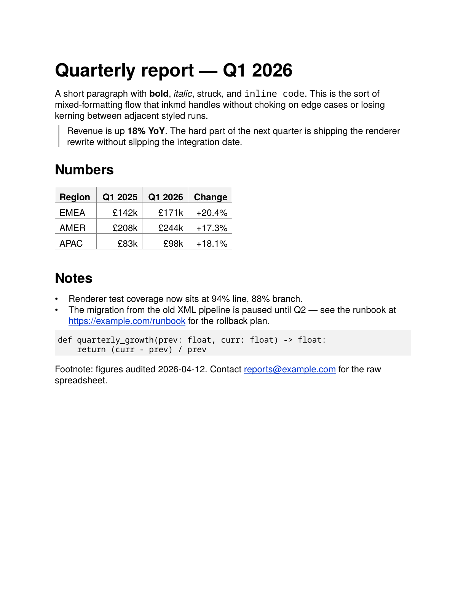

# inkmd

**Markdown to PDF, pure Python, zero dependencies. MIT-licensed. Deterministic.**

```sh
pip install inkmd
inkmd in.md -o out.pdf
```

That's the whole install. No system packages, no fonts to install, no Chrome binary, no `apt-get`. Works the same on macOS, Linux, Windows, Alpine, AWS Lambda, a locked-down CI runner, or a Steam Deck.

<p align="center">
  
  <br>
  <em><a href="examples/hero-sample.md">examples/hero-sample.md</a> rendered through inkmd: headings, inline styles, strikethrough, blockquote, GFM table, list, fenced code, autolinked URL and email all in one page.</em>
  <br>
  <em>See also <a href="examples/inkmd-brief.md">examples/inkmd-brief.md</a>, a two-page project brief written in inkmd-renderable markdown.</em>
</p>

## What you get

- **A single pure-Python wheel.** No native extensions, no system libraries. Installs in under a second.
- **Faithful CommonMark plus the parts of GFM people actually use:** tables, autolinks, strikethrough, fenced code with language tags. The [supported features](#supported-markdown) section has the full matrix.
- **PDFs that look right.** Real AFM-driven kerning emitted via TJ arrays, clickable links, tinted code-block backgrounds, blockquote rules that stack for nested quotes, table alignment, headings that breathe.
- **Byte-identical output for the same input.** No clocks, no random IDs. Useful for version control, signed PDFs, audit trails, reproducible CI.
- **Two layers of API:** a CLI and a `compile()` / `render_file()` library function. The whole public surface is two functions.

## Benchmarks

Measured against `WeasyPrint + markdown` (the closest pure-Python alternative) on the same input documents, on the same machine. Methodology and full caveats in [`BENCHMARKS.md`](BENCHMARKS.md); the script is at `scripts/bench.py` and is reproducible.

| Metric | inkmd | WeasyPrint | Ratio |
|--------|-------|------------|-------|
| Install size (venv) | 11.6 MB | 74.5 MB | 6.4x smaller |
| Cold-start render, ~1 page | 112 ms | 741 ms | 6.6x faster |
| Cold-start render, ~11 pages | 148 ms | 1.40 s | 9.5x faster |
| Peak RSS, ~11 pages | 17 MB | 122 MB | 7.3x lower |

WeasyPrint produces slightly smaller PDFs for documents over a few pages (it compresses content streams; inkmd does not). WeasyPrint also supports full Unicode, page-splitting tables, and CSS, which inkmd does not. inkmd does support images as of v0.2 (PNG and JPEG embedding). The right tool depends on your input and your environment — the [comparisons doc](docs/comparisons.md) has the full picture.

## Why this exists

Markdown to PDF is a solved problem in theory and a minefield in practice. Every other tool brings heavy system dependencies that don't survive the trip into an Alpine container, a Lambda function, or a Windows machine without admin rights.

| Tool | What goes wrong |
|------|-----------------|
| **wkhtmltopdf** | Deprecated since 2023. Unpatched CVEs. |
| **Chrome headless / Puppeteer** | 200MB+ install. 5 to 15s cold-start latency. |
| **WeasyPrint** | Needs Pango, cairo, GObject (350 to 550MB of system packages). Breaks on Alpine and Windows. |
| **Pandoc + LaTeX** | 3GB texlive install. |
| **PyMuPDF-based tools** | Don't build on Alpine musl. |
| **`borb`** | AGPL, so unusable in closed-source or commercial projects without a paid licence. |

`inkmd` runs anywhere Python runs. It's the markdown-to-PDF compiler you'd write yourself with a free weekend if you didn't want to take a dependency on a browser.

For the longer, honest version of how inkmd compares against every realistic alternative (including where inkmd is worse), see [`docs/comparisons.md`](docs/comparisons.md).

## Use cases

- **CI documentation pipelines.** Compile READMEs, release notes, or changelogs to PDF as a build artefact, in a stripped-down container, without `apt-get`.
- **Agent-generated documents.** LLM agents that need to deliver a PDF (CVs, reports, summaries) can call `inkmd.compile()` directly. No subprocess, no shell-out, no Chrome.
- **Reproducible audit trails.** Hash the markdown, hash the PDF, and the same input gives the same output bytes. Useful for compliance, signed reports, version-controlled docs.
- **Serverless rendering.** Lambda plus zero system dependencies equals a PDF endpoint that cold-starts in well under a second.
- **Restricted environments.** Locked-down CI runners, embedded hardware, anywhere installing a 200MB browser isn't an option.

## Status

**v0.2, MIT-licensed.** 649 tests across 28 files. Stdlib-only, Python 3.9+. Byte-deterministic output.

Conformance against the public spec suites: CommonMark 0.31.2 at 554/652 (85.0%); GFM extensions at 20/28 (71.4%). The full per-section breakdown, the v0.3-tier and v0.4-tier classification of remaining failures, and the real-world-impact framing are in [`docs/conformance.md`](docs/conformance.md). Threat model in [`docs/security.md`](docs/security.md). Edge-case render samples committed as PDFs in [`docs/gallery/`](docs/gallery/).

The v0.2 design principle is **utter consistency**: for any markdown construct the CommonMark spec has a clear answer about, inkmd follows that answer. The conformance percentage is a proxy for "what GitHub showed you is what you get" — it isn't the goal in itself.

## Install

From PyPI:

```sh
pip install inkmd
```

Or grab the single-file zipapp (no `pip` install required). Each tagged release attaches an `inkmd.pyz` of around 300 KB that you can drop anywhere Python 3.9+ is available:

```sh
curl -L -o inkmd.pyz https://github.com/eagredev/inkmd/releases/latest/download/inkmd.pyz
python inkmd.pyz in.md -o out.pdf
```

Or build it yourself from a checkout:

```sh
python scripts/build_zipapp.py    # produces dist/inkmd.pyz
```

## Usage

### CLI

```sh
inkmd in.md -o out.pdf              # file in, file out
inkmd in.md > out.pdf               # file in, stdout out
inkmd < in.md > out.pdf             # stdin in, stdout out
inkmd in.md -o out.pdf --page-size A4 --family times
inkmd in.md -o out.pdf --no-autolinks --no-html
inkmd in.md -o out.pdf --allow-remote-images   # fetch http(s) image URLs
inkmd in.md -o out.pdf --allow-unsafe-urls     # disable URL scheme filter
inkmd --version
```

### Library

```python
import inkmd

# Compile markdown text to PDF bytes
pdf_bytes = inkmd.compile(md_text)

# Or convert files directly
inkmd.render_file("in.md", "out.pdf")

# Options (same on both functions)
pdf_bytes = inkmd.compile(
    md_text,
    page_size="A4",          # or "letter" (default)
    family="times",          # or "helvetica" (default)
    autolinks=False,         # opt out of GFM bare-URL/email detection
    safe=True,               # URL scheme allow-list (default True)
    html=True,               # inline HTML allow-list (default True)
    allow_remote_images=False,  # explicit opt-in to fetch http(s) images
)
```

The public API is intentionally narrow: two functions, no classes to instantiate, no state to manage. The CLI is a thin argparse wrapper around `compile()`.

## Supported markdown

### CommonMark

| Feature | inkmd |
|---------|:---:|
| Paragraphs with line wrapping | Yes |
| ATX headings (`#` to `######`) | Yes |
| Setext headings (`===` / `---`) | Yes |
| Ordered lists, arbitrary `start` | Yes |
| Unordered lists (`-` / `*` / `+`) | Yes |
| Nested lists, mixed marker types | Yes |
| Tight vs. loose list detection | Yes |
| Blockquotes | Yes |
| Nested and multi-paragraph blockquotes | Yes |
| Blockquotes wrapping any block type | Yes |
| Blockquote lazy continuation | Yes |
| Fenced code blocks | Yes |
| Code block language tag (info string) | Yes |
| Indented code blocks | Yes |
| Indented code blocks inside list items | Yes |
| Tabs preserved verbatim inside code | Yes |
| Code spans (`` `code` ``, multi-backtick) | Yes |
| Emphasis (`*`, `_`) | Yes |
| Strong emphasis (`**`, `__`) | Yes |
| Triple `***` becomes nested italic-bold | Yes |
| Rule of 3 plus intraword-underscore | Yes |
| Backslash escapes | Yes |
| Thematic breaks | Yes |
| Inline links `[text](url)` | Yes |
| Inline link titles (`"..."`, `'...'`, `(...)`) | Yes |
| Angle-bracket autolinks `<url>` | Yes |
| Reference links (`[t][ref]`, `[ref][]`, `[ref]`) | Yes |
| Reference link definitions (`[ref]: url "title"`) | Yes |
| Hard line breaks (two-space or backslash form) | Yes |
| Soft line breaks | Yes |
| HTML5 entity references (`&amp;`, `&#42;`) | Yes |
| Images `` | Yes |
| Reference-style images `![alt][ref]` | Yes |
| Image-inside-link `[](/repo)` | Yes |
| Inline HTML allow-list (`<sub>`, `<mark>`, `<u>`, `<kbd>`, `<br>`) | Yes |
| Block-level raw HTML | v0.3 |

### GFM extensions

| Feature | inkmd |
|---------|:---:|
| Pipe tables | Yes |
| Table column alignments | Yes |
| Bare URL autolinks (`https://...`, `www....`) | Yes |
| Bare host autolinks (`host.tld/path`) | Yes |
| Email autolinks (`<addr@host>`) | Yes |
| Bare email autolinks (no angle brackets) | v0.3 |
| Bare `mailto:` / `xmpp:` schemes | v0.3 |
| Strikethrough `~~text~~` / `~text~` | Yes |
| Task lists `- [ ]` / `- [x]` | Yes |
| Disallowed-HTML filter | curated subset |

### Visual output

- Clickable PDF `/Link` annotations on every URL, inline links and autolinks alike.
- Blue underlined link text.
- Light-grey background tint behind fenced code blocks.
- Thin grey vertical rules for blockquotes. Stacked side-by-side for nested quotes.
- Tinted table headers with full grid borders and per-column alignment.
- AFM-correct kerning emitted via TJ arrays (Helvetica and Times both fully kerned).
- Strikethrough drawn as a thin horizontal bar at glyph mid-height.

### Typography

- Helvetica family (default) or Times family. Code uses Courier.
- Standard PDF letter and A4 page sizes.
- WinAnsi character encoding: em-dash, en-dash, curly quotes, ellipsis, most Western European glyphs.
- Codepoints outside WinAnsi (CJK, Cyrillic, emoji, most non-Latin scripts) render as `?` in v0.1. v0.2 lifts this with font embedding.

## Determinism

`inkmd` produces **byte-identical** PDF output for the same markdown input on every platform, every Python version, every run. No real-time clocks, no random IDs, no platform-dependent iteration order.

If you hash the markdown and the PDF, the relationship is stable forever. Useful for version-controlled documents, signed/hashed PDFs, reproducible CI builds, and audit trails.

## What `inkmd` doesn't do yet

| Feature | When | Why |
|---------|------|-----|
| TTF / OTF font embedding | v0.3 | v0.2 uses PDF's 14 base fonts. Tiny output, no font files to ship, but limits codepoints to WinAnsi |
| Block-level raw HTML (`<table>...</table>` etc.) | v0.3 | inkmd v0.2 covers **inline** HTML via the safe allow-list; block-level passthrough is queued |
| Headers, footers, page numbers | v0.3 | Needs a per-page chrome system |
| Page-splitting for oversized tables | v0.3 | Tables currently place atomically and overflow if taller than a page |
| Tables inside blockquotes | v0.3 | Table detection runs at document level only |
| Blockquote inside a list item | v0.3 | `>` inside an item renders as paragraph text in v0.2; per-item blockquote state coming |
| RGBA / indexed PNG embedding | v0.3 | v0.2 supports RGB and grayscale PNG; common screen-grab RGBA needs the alpha-channel pipeline |
| GIF image support | v0.3 | LZW decoder + palette resolution |
| Tagged PDF / PDF/UA accessibility | v1.0+ | Under consideration |
| PDF/A archival format | n/a | Not planned |
| Math (LaTeX-style) | n/a | Out of scope. Use Pandoc + LaTeX. |
| Themes / CSS | n/a | Out of scope. Markdown's value is its constraints. |

## How it works

Four layers, each strictly above the previous:

1. **`parser`** is a single-pass container-aware block parser plus a CommonMark inline tokeniser. Produces a frozen-dataclass AST.
2. **`render`** lowers AST blocks to `RenderedBlock` records with runs, spacing, indent, decorations. Carries font and link state through inline nesting.
3. **`layout`** wraps runs into pages, positions each `PositionedRun` against the page coordinate system, emits background rectangles for code blocks, vertical rules for blockquotes, underline plus annotation pairs for links, and bars for strikethrough.
4. **`pdf`** serialises pages into PDF bytes. Text via `Tj`/`TJ`-with-kerning, graphics via `rg`/`re`/`f`, link annotations via per-page `/Annots` arrays.

No layer imports a higher one. The whole pipeline is around 3,500 lines of pure-Python logic plus 4,700 lines of generated AFM kerning tables. That's it. For a deeper walk-through (the emphasis algorithm, AFM kerning, determinism mechanics), see [`docs/internals.md`](docs/internals.md). The complexity profile is in [`LIZARD-AUDIT.md`](LIZARD-AUDIT.md).

<details>
<summary><strong>A note on font rendering in v0.1</strong></summary>

`inkmd` v0.1 uses PDF's **14 base fonts** (Helvetica, Times, Courier, Symbol, ZapfDingbats and their variants). These are spec-mandated to be available in every conforming PDF reader, so we don't ship any font files. The output stays tiny and dependency-free.

The trade-off is that the *actual rendering* depends on which Helvetica (or Times, etc.) the reader's system provides:

- **macOS** ships Helvetica Neue (real Helvetica). Renders as designed.
- **Windows** with Adobe Reader ships real Helvetica. Renders as designed.
- **Linux** typically substitutes Nimbus Sans (URW++'s free Helvetica clone). Renders very similarly but with slightly different side bearings, so spacing between glyphs can look subtly different.
- **Mobile** (iOS / Android) ships system Helvetica or Roboto variants. Mostly fine.

The advance widths are correct everywhere (PDF readers honour the AFM-published metrics), so layout (page breaks, line wrapping, paragraph flow) is identical across systems. What varies is the precise glyph shape *within* each advance-width box, which can produce slightly different visual spacing.

For most use cases this is fine. If you need pixel-identical rendering across every system (signed or archival documents, for example), wait for **v0.2 font embedding**, which will bundle font outlines inside each PDF.

</details>

## Roadmap

The release tiers are about **what a real user sees**, not about chasing a percentage.

- **v0.1** — Proof of concept: working basic PDFs. **Shipped.**
- **v0.2** — Most sane use cases work; remaining failures are rare and defensible. **Shipped.** CommonMark 85%, GFM extensions 71%. Adds reference links, images (PNG + JPEG), task lists, inline HTML allow-list, hard line breaks, indented code blocks (including inside list items), URL scheme filter, tab preservation, image-inside-link.
- **v0.3** — Visually identical for the user even where spec tests still fail. Adds block-level raw HTML pass-through, blockquote-inside-list, headers/footers/page numbers, page-splitting for oversized tables, TTF font embedding (full Unicode), RGBA/indexed PNG, GIF.
- **v0.4** — 100% CommonMark and 100% GFM extensions. The long-tail spec-corner cases.
- **v1.0 and beyond** — Tagged PDF, accessibility, TOC generation, cross-references. PDF/A and similar under consideration.

## Licence

MIT. See [LICENSE](LICENSE).

## Acknowledgements

The 14 standard PDF fonts and their AFM metric files are public-domain artefacts published by Adobe ([adobe-type-tools/Core14_AFMs](https://github.com/adobe-type-tools/Core14_AFMs)). PDF format reference: ISO 32000-1.

## About

Built by [Dylan Moir](https://www.linkedin.com/in/dylanmoir/). If `inkmd` saves you a fight with WeasyPrint or a 200MB Chrome install in your CI, a star on the repo is plenty.
