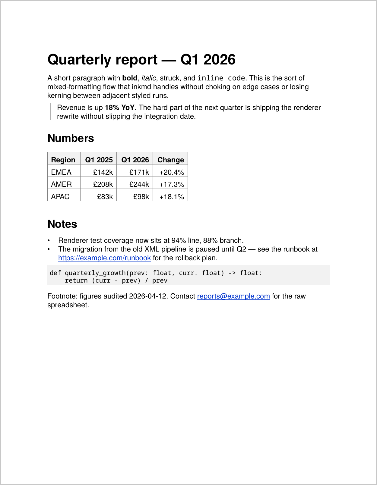

# inkmd

**Markdown to PDF, pure Python, zero dependencies. MIT-licensed. Deterministic.**

```sh
pip install inkmd
inkmd in.md -o out.pdf
```

That's the whole install. No system packages, no system fonts, no Chrome binary, no `apt-get`. Works the same on macOS, Linux, Windows, Alpine, AWS Lambda, a locked-down CI runner, or a Steam Deck. Color emoji are bundled, so they render anywhere without a system emoji font.

<p align="center">
  
  <br>
  <em><a href="examples/hero-sample.md">examples/hero-sample.md</a> rendered through inkmd: headings, inline styles, strikethrough, blockquote, GFM table, list, fenced code, autolinked URL and email all in one page.</em>
  <br>
  <em>See also <a href="examples/inkmd-brief.md">examples/inkmd-brief.md</a>, a two-page project brief written in inkmd-renderable markdown.</em>
</p>

## What you get

- **A single pure-Python wheel.** No native extensions, no system libraries. Installs in under a second.
- **Faithful CommonMark plus the parts of GFM people actually use:** tables, autolinks, strikethrough, fenced code with language tags. The [supported features](#supported-markdown) section has the full matrix.
- **Color emoji that render anywhere.** 🚀 ✅ 🇯🇵 👍🏽 single emoji, flags, skin tones, and ZWJ sequences (families, the rainbow flag) all render as color glyphs, inline and in table cells, from a bundled font. No system emoji font required.
- **PDFs that look right.** Real AFM-driven kerning emitted via TJ arrays, clickable links, tinted code-block backgrounds, blockquote rules that stack for nested quotes, table alignment, headings that breathe.
- **Byte-identical output for the same input.** No clocks, no random IDs. Useful for version control, signed PDFs, audit trails, reproducible CI.
- **Two layers of API:** a CLI and a `compile()` / `render_file()` library function. The whole public surface is two functions.

## Benchmarks

Measured against `WeasyPrint + markdown` (the closest pure-Python alternative) on the same input documents, on the same machine. Methodology and full caveats in [`BENCHMARKS.md`](BENCHMARKS.md); the script is at `scripts/bench.py` and is reproducible.

| Metric | inkmd | WeasyPrint | Ratio |
|--------|-------|------------|-------|
| Cold-start render, ~1 page | 138 ms | 731 ms | 5.3x faster |
| Cold-start render, ~11 pages | 201 ms | 1.40 s | 7.0x faster |
| Peak RSS, ~11 pages | 20 MB | 122 MB | 6.2x lower |
| Install size (venv) | 22.3 MB | 74.6 MB | 3.3x smaller, zero system deps |

WeasyPrint produces slightly smaller PDFs for documents over a few pages (it compresses content streams; inkmd does not). WeasyPrint also supports full Unicode, page-splitting tables, and CSS, which inkmd does not. inkmd does support images (PNG and JPEG embedding). The right tool depends on your input and your environment; the [comparisons doc](docs/comparisons.md) has the full picture.

## Why this exists

Markdown to PDF is a solved problem in theory and a minefield in practice. Every other tool brings heavy system dependencies that don't survive the trip into an Alpine container, a Lambda function, or a Windows machine without admin rights.

| Tool | What goes wrong |
|------|-----------------|
| **wkhtmltopdf** | Deprecated since 2023. Unpatched CVEs. |
| **Chrome headless / Puppeteer** | 200MB+ install. 5 to 15s cold-start latency. |
| **WeasyPrint** | Needs Pango, cairo, GObject (350 to 550MB of system packages). Breaks on Alpine and Windows. |
| **Pandoc + LaTeX** | 3GB texlive install. |
| **PyMuPDF-based tools** | Don't build on Alpine musl. |
| **`borb`** | AGPL, so unusable in closed-source or commercial projects without a paid licence. |

`inkmd` runs anywhere Python runs: a markdown-to-PDF compiler written from scratch in pure Python, with no browser, no system libraries, and no native extensions behind it.

For the longer, honest version of how inkmd compares against every realistic alternative (including where inkmd is worse), see [`docs/comparisons.md`](docs/comparisons.md).

## Use cases

- **CI documentation pipelines.** Compile READMEs, release notes, or changelogs to PDF as a build artefact, in a stripped-down container, without `apt-get`.
- **Agent-generated documents.** LLM agents that need to deliver a PDF (CVs, reports, summaries) can call `inkmd.compile()` directly. No subprocess, no shell-out, no Chrome.
- **Reproducible audit trails.** Hash the markdown, hash the PDF, and the same input gives the same output bytes. Useful for compliance, signed reports, version-controlled docs.
- **Serverless rendering.** Lambda plus zero system dependencies equals a PDF endpoint that cold-starts in well under a second.
- **Restricted environments.** Locked-down CI runners, embedded hardware, anywhere installing a 200MB browser isn't an option.

## Status

**v0.4, MIT-licensed.** 955 tests across 42 files. Stdlib-only, Python 3.9+. Byte-deterministic output.

Conformance against the public spec suites, as shipped in this release: CommonMark 0.31.2 at 652/652 (100%); GFM extensions at 28/28 (100%). The full per-section breakdown is in [`docs/conformance.md`](docs/conformance.md). Threat model in [`docs/security.md`](docs/security.md). Spec-edge render samples in [`docs/gallery/`](docs/gallery/), and a real-world rendering gallery (the Ruff README, a Rust Book chapter, a Simon Willison TIL, a non-Latin scripts showcase, and inkmd's own README) in [`docs/gallery/real-world/`](docs/gallery/real-world/).

The design principle is **utter consistency**: for any markdown construct the CommonMark spec has a clear answer about, inkmd follows that answer. The conformance percentage is a proxy for "what GitHub showed you is what you get"; it isn't the goal in itself.

## Install

From PyPI:

```sh
pip install inkmd
```

Or grab the single-file zipapp (no `pip` install required). Each tagged release attaches an `inkmd.pyz` of around 170 KB that you can drop anywhere Python 3.9+ is available:

```sh
curl -L -o inkmd.pyz https://github.com/eagredev/inkmd/releases/latest/download/inkmd.pyz
python inkmd.pyz in.md -o out.pdf
```

Or build it yourself from a checkout:

```sh
python scripts/build_zipapp.py    # produces dist/inkmd.pyz
```

## Usage

### CLI

```sh
inkmd in.md -o out.pdf              # file in, file out
inkmd in.md > out.pdf               # file in, stdout out
inkmd < in.md > out.pdf             # stdin in, stdout out
inkmd in.md -o out.pdf --page-size A4 --family times
inkmd in.md -o out.pdf --no-autolinks --no-html
inkmd in.md -o out.pdf --allow-remote-images   # fetch http(s) image URLs
inkmd in.md -o out.pdf --allow-unsafe-urls     # disable URL scheme filter
inkmd in.md -o out.pdf --emoji-fallback drop   # only matters in the no-font build
inkmd --version
```

### Library

```python
import inkmd

# Compile markdown text to PDF bytes
pdf_bytes = inkmd.compile(md_text)

# Or convert files directly
inkmd.render_file("in.md", "out.pdf")

# Options (same on both functions)
pdf_bytes = inkmd.compile(
    md_text,
    page_size="A4",          # or "letter" (default)
    family="times",          # or "helvetica" (default)
    autolinks=False,         # opt out of GFM bare-URL/email detection
    safe=True,               # URL scheme allow-list (default True)
    html=True,               # inline HTML allow-list (default True)
    allow_remote_images=False,  # explicit opt-in to fetch http(s) images
    emoji_fallback="name",   # for emoji the font can't render: "name" -> [rocket], or "drop"
)
```

Emoji render as color glyphs out of the box (the font is bundled). Set the
`INKMD_NO_EMOJI=1` environment variable to disable emoji rendering; emoji
then take the `emoji_fallback` path (`"name"` gives a `[rocket]`-style label, or
`"drop"`). The single-file zipapp build ships without the font and behaves
the same way.

The public API is intentionally narrow: two functions, no classes to instantiate, no state to manage. The CLI is a thin argparse wrapper around `compile()`.

## Supported markdown

### CommonMark

| Feature | inkmd |
|---------|:---:|
| Paragraphs with line wrapping | Yes |
| ATX headings (`#` to `######`) | Yes |
| Setext headings (`===` / `---`) | Yes |
| Ordered lists, arbitrary `start` | Yes |
| Unordered lists (`-` / `*` / `+`) | Yes |
| Nested lists, mixed marker types | Yes |
| Tight vs. loose list detection | Yes |
| Blockquotes | Yes |
| Nested and multi-paragraph blockquotes | Yes |
| Blockquotes wrapping any block type | Yes |
| Blockquote lazy continuation | Yes |
| Fenced code blocks | Yes |
| Code block language tag (info string) | Yes |
| Indented code blocks | Yes |
| Indented code blocks inside list items | Yes |
| Tabs preserved verbatim inside code | Yes |
| Code spans (`` `code` ``, multi-backtick) | Yes |
| Emphasis (`*`, `_`) | Yes |
| Strong emphasis (`**`, `__`) | Yes |
| Triple `***` becomes nested italic-bold | Yes |
| Rule of 3 plus intraword-underscore | Yes |
| Backslash escapes | Yes |
| Thematic breaks | Yes |
| Inline links `[text](url)` | Yes |
| Inline link titles (`"..."`, `'...'`, `(...)`) | Yes |
| Angle-bracket autolinks `<url>` | Yes |
| Reference links (`[t][ref]`, `[ref][]`, `[ref]`) | Yes |
| Reference link definitions (`[ref]: url "title"`) | Yes |
| Hard line breaks (two-space or backslash form) | Yes |
| Soft line breaks | Yes |
| HTML5 entity references (`&amp;`, `&#42;`) | Yes |
| Images `` | Yes |
| Reference-style images `![alt][ref]` | Yes |
| Image-inside-link `[](/repo)` | Yes |
| Inline HTML allow-list (`<sub>`, `<mark>`, `<u>`, `<kbd>`, `<br>`) | Yes |
| HTML `` (incl. `width` + `align`, and the `<p align>` figure idiom) | Yes |
| Block-level raw HTML (`<table>`, `<div>` layout, arbitrary tags) | Yes |

### GFM extensions

| Feature | inkmd |
|---------|:---:|
| Pipe tables | Yes |
| Table column alignments | Yes |
| Bare URL autolinks (`https://...`, `www....`) | Yes |
| Bare host autolinks (`host.tld/path`) | Yes |
| Email autolinks (`<addr@host>`) | Yes |
| Bare email autolinks (no angle brackets) | Yes |
| Bare `mailto:` / `xmpp:` schemes | Yes |
| Strikethrough `~~text~~` / `~text~` | Yes |
| Task lists `- [ ]` / `- [x]` | Yes |
| Disallowed-HTML filter | curated subset |

### Visual output

- Clickable PDF `/Link` annotations on every URL, inline links and autolinks alike.
- Blue underlined link text.
- Light-grey background tint behind fenced code blocks.
- Thin grey vertical rules for blockquotes. Stacked side-by-side for nested quotes.
- Tinted table headers with full grid borders and per-column alignment.
- AFM-correct kerning emitted via TJ arrays (Helvetica and Times both fully kerned).
- Strikethrough drawn as a thin horizontal bar at glyph mid-height.

### Typography

- Helvetica family (default) or Times family. Code uses Courier.
- Standard PDF letter and A4 page sizes.
- WinAnsi character encoding: em-dash, en-dash, curly quotes, ellipsis, most Western European glyphs.
- **Color emoji** render as inline images from a bundled font: single emoji, presentation selectors, regional-indicator flags, skin-tone modifiers, ZWJ sequences (families, the rainbow flag), and keycaps, inline and in table cells. (Bitmaps scaled to text size; they soften slightly at very large heading sizes.)
- Non-Latin scripts (Cyrillic, Greek, Latin-Extended) render through an embedded font (the bundled DejaVuSans, or any TrueType font via `font_path=`). A codepoint no available font covers (e.g. CJK, which the bundled font lacks) renders a visible `[U+XXXX]` marker rather than a silent `?`, and inkmd emits a warning. CJK full rendering is a planned later font pack.

## Determinism

`inkmd` produces **byte-identical** PDF output for the same markdown input on every platform, every Python version, every run. No real-time clocks, no random IDs, no platform-dependent iteration order.

If you hash the markdown and the PDF, the relationship is stable forever. Useful for version-controlled documents, signed/hashed PDFs, reproducible CI builds, and audit trails.

## What `inkmd` doesn't do yet

| Feature | When | Why |
|---------|------|-----|
| Non-Latin text (Cyrillic, Greek, Latin-Extended) | v0.4 | inkmd uses PDF's 14 base fonts for text (WinAnsi), so characters outside that set used to render as `?`. v0.4 adds text-font embedding from a bundled font, which makes these scripts render. A codepoint the bundled font lacks (e.g. CJK) shows a visible `[U+XXXX]` marker; a CJK font pack is planned for a later release |
| Right-to-left and complex scripts (Arabic, Hebrew, Indic) | v1.0 | Correct bidirectional layout and shaping. Shaping ships as an optional `inkmd[shaping]` add-on (the one part of inkmd that uses a dependency, because it needs one) |
| Headers, footers, page numbers | v0.6 | Needs a per-page chrome system on top of a look-ahead paginator |
| Table of contents, bookmarks, working internal links | v0.6 | Generated from heading structure once the paginator can resolve page positions |
| Wide-table column fitting | v0.5 | A table **taller** than a page already splits across pages, repeating the header. A table with too many **columns** to fit even at minimum legible width still overflows the right edge. Horizontal fitting (auto-shrink / landscape) is queued |
| Margin, font-size, line-spacing, page-size control | v0.5 | Currently fixed; being exposed through the API |
| Syntax highlighting, footnotes, callouts, captions | v0.8 | Document constructs the docs and report use cases expect |
| RGBA PNG embedding | v0.9 | inkmd supports RGB, grayscale, and **indexed** PNG (with `tRNS` transparency); full RGBA alpha is queued |
| GIF image support | v0.9 | LZW decoder + palette resolution |
| Justified text, hyphenation, ligatures | v0.9 | Typesetting polish |
| Tagged PDF / PDF/UA accessibility | v1.0 | Structure tree, reading order, alt text |
| PDF/A archival format | v1.0 | OutputIntent, embedded ICC profile, deterministic document ID |
| Math (LaTeX-style) | not planned | Out of scope. Use Pandoc + LaTeX. |
| Themes / CSS | not planned | Out of scope. Markdown's value is its constraints. |
| Prepress (bleed/crop marks, CMYK), forms, EPUB | not planned | inkmd targets office and desktop documents, not print production or reflowable e-books |

## How it works

Four layers, each strictly above the previous:

1. **`parser`** is a single-pass container-aware block parser plus a CommonMark inline tokeniser. Produces a frozen-dataclass AST.
2. **`render`** lowers AST blocks to `RenderedBlock` records with runs, spacing, indent, decorations. Carries font and link state through inline nesting.
3. **`layout`** wraps runs into pages, positions each `PositionedRun` against the page coordinate system, emits background rectangles for code blocks, vertical rules for blockquotes, underline plus annotation pairs for links, and bars for strikethrough.
4. **`pdf`** serialises pages into PDF bytes. Text via `Tj`/`TJ`-with-kerning, graphics via `rg`/`re`/`f`, link annotations via per-page `/Annots` arrays.

No layer imports a higher one. The whole pipeline is around 11,200 lines of pure-Python logic (including the hand-rolled OpenType reader behind color emoji) plus 4,700 lines of generated AFM kerning tables. That's it. For a deeper walk-through (the emphasis algorithm, AFM kerning, color-emoji bitmap extraction, determinism mechanics), see [`docs/internals.md`](docs/internals.md). The complexity profile is in [`LIZARD-AUDIT.md`](LIZARD-AUDIT.md).

<details>
<summary><strong>A note on font rendering</strong></summary>

`inkmd` uses PDF's **14 base fonts** (Helvetica, Times, Courier, Symbol, ZapfDingbats and their variants) for text. These are spec-mandated to be available in every conforming PDF reader, so we don't ship any font files. The output stays tiny and dependency-free.

The trade-off is that the *actual rendering* depends on which Helvetica (or Times, etc.) the reader's system provides:

- **macOS** ships Helvetica Neue (real Helvetica). Renders as designed.
- **Windows** with Adobe Reader ships real Helvetica. Renders as designed.
- **Linux** typically substitutes Nimbus Sans (URW++'s free Helvetica clone). Renders very similarly but with slightly different side bearings, so spacing between glyphs can look subtly different.
- **Mobile** (iOS / Android) ships system Helvetica or Roboto variants. Mostly fine.

The advance widths are correct everywhere (PDF readers honour the AFM-published metrics), so layout (page breaks, line wrapping, paragraph flow) is identical across systems. What varies is the precise glyph shape *within* each advance-width box, which can produce slightly different visual spacing.

For most use cases this is fine. If you need pixel-identical rendering across every system (signed or archival documents, for example), use **`font_path=`** to embed a TrueType font, which bundles the font outlines inside each PDF. v0.4 embeds the bundled DejaVuSans for non-Latin text automatically.

</details>

## Roadmap

The release tiers are about **what a real user sees**, not about chasing a percentage.

- **v0.1:** Proof of concept: working basic PDFs. **Shipped.**
- **v0.2:** Most sane use cases work; remaining failures are rare and defensible. CommonMark 85%, GFM extensions 71%. Adds reference links, images (PNG + JPEG + indexed PNG with transparency), **color emoji** (single, flags, skin tones, ZWJ sequences, keycaps, inline and in tables), task lists, inline HTML allow-list, hard line breaks, indented code blocks (including inside list items), URL scheme filter, tab preservation, image-inside-link.
- **v0.3:** 100% CommonMark and 100% GFM extensions. The long-tail spec-corner cases, including block-level raw HTML pass-through and HTML blocks inside list items.
- **v0.4:** Text-font embedding. Non-Latin scripts (Cyrillic, Greek, Latin-Extended) render through a bundled embedded font instead of falling back to `?`, and the embedded font makes a document look the same in every viewer. A codepoint the bundled font does not cover (e.g. CJK) shows a visible `[U+XXXX]` marker; CJK full rendering is a planned later font pack. **Shipped.**
- **v0.5:** Page and layout control. Margins, font size, line spacing, page size and orientation, forced page breaks, and horizontal fitting for very wide tables.
- **v0.6:** Multi-page document structure. Running headers, footers, and page numbers; a generated table of contents; PDF bookmarks; and working internal links.
- **v0.7:** Pipeline features. Document metadata, basic frontmatter parsing, clear errors instead of tracebacks, a strict mode that reports failed images, configurable URL and HTML schemes, path and resource limits, and opt-in output compression.
- **v0.8:** Document constructs. Syntax highlighting, footnotes, GitHub-style callouts, figure and table captions, and definition lists.
- **v0.9:** Typesetting and images. Justified text, hyphenation, ligatures, full RGBA PNG and GIF, image resolution handling, watermarks, and title pages.
- **v1.0:** Right-to-left and complex scripts (Arabic, Hebrew, Indic), PDF/A archival output, and tagged-PDF accessibility. The endpoint where inkmd renders any major language and produces archival-grade output.

## Licence

MIT. See [LICENSE](LICENSE).

The bundled color-emoji font is **Noto Color Emoji** (© Google), distributed under the [SIL Open Font License 1.1](src/inkmd/assets/emoji/OFL.txt), a separate permissive licence from inkmd's own MIT code. It is shipped unmodified.

## Acknowledgements

The 14 standard PDF fonts and their AFM metric files are public-domain artefacts published by Adobe ([adobe-type-tools/Core14_AFMs](https://github.com/adobe-type-tools/Core14_AFMs)). Color emoji are rendered from Google's [Noto Color Emoji](https://github.com/googlefonts/noto-emoji) (SIL OFL 1.1). PDF format reference: ISO 32000-1.

## About

Built by [Dylan Moir](https://www.linkedin.com/in/dylanmoir/). Architecture, problem decomposition, and implementation directed end-to-end through AI tooling (Claude Code), with every output reviewed. Sister projects: [Nightjar](https://github.com/eagredev/nightjar), an autonomous LLM agent with a defence-in-depth security architecture, and [TORCH](https://github.com/eagredev/TORCH), an AI-orchestrated IDE.

If `inkmd` saves you a fight with WeasyPrint or a 200MB Chrome install in your CI, a star on the repo is plenty.
